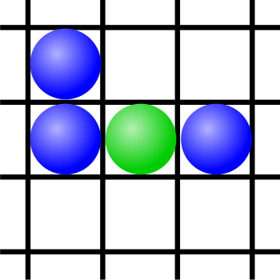
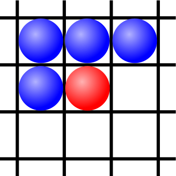
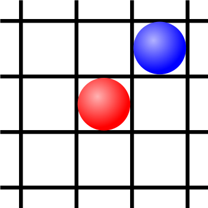
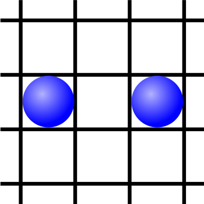

- title : CARA Lyon - Coding Dojo - Message Passing
- description : Session de mai 2015
- author : Florent PELLET
- theme : night
- transition : default

***
### Message Passing
#### CARA Lyon - Coding dojo - mai 2015

***
### Merci

***
### LyonTechHub
#### http://www.lyontechhub.org

- 13/06 : Code Retreat legacy !

- 28/05 : MUG Lyon - Refactoring en mode DevOps : du mythe à la réalité
- Courant Mai : Mathias Brandewinder

***
### Votre communauté
#### Google Groups ([cara-dojo](https://groups.google.com/forum/?hl=fr#!forum/cara-dojo)) / Twitter ([@coderetreatlyon](https://twitter.com/coderetreatlyon))

- Proposition d'idées de sujet
- Promotion
- Sponsors

***
### Tell don't ask / message passing
- Pas de retour de méthode
- Considérez les objets comme des *threads* communiquants par envois de messages

***
### Sujet
#### Conway's Game of Life

---
### 
Toute cellule **morte** avec **exactement 3 voisines** vivantes, **nait** par **reproduction**

---
### 
Toute cellule **vivante** avec **plus de 3 voisines** vivantes, **meurt** par **surpopulation**

---
### 
Toute cellule **vivante** avec **moins de 2 voisines** vivantes, **meurt** par **sous-population**

---
### 
Toute cellule avec **exactement de 2 voisines** vivantes **reste** dans l'**état actuel**

---
- Toute cellule **morte** avec **exactement 3 voisines** vivantes, **nait** par **reproduction**
- Toute cellule **vivante** avec **plus de 3 voisines** vivantes, **meurt** par **surpopulation**
- Toute cellule **vivante** avec **moins de 2 voisines** vivantes, **meurt** par **sous-population**
- Toute cellule avec **exactement de 2 voisines** vivantes **reste** dans l'**état actuel**

***

